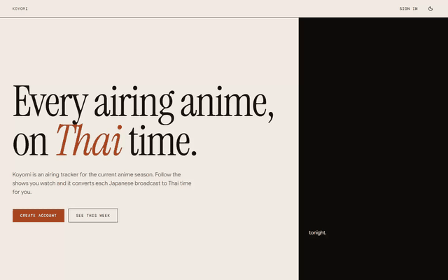
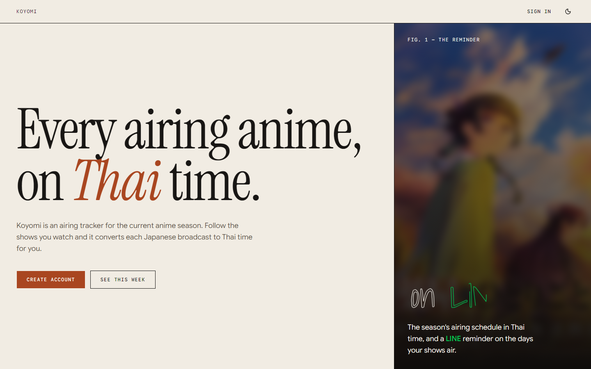
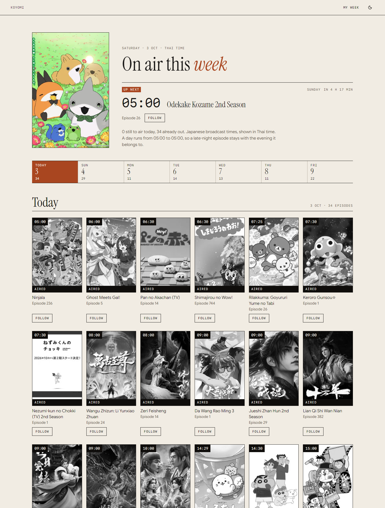
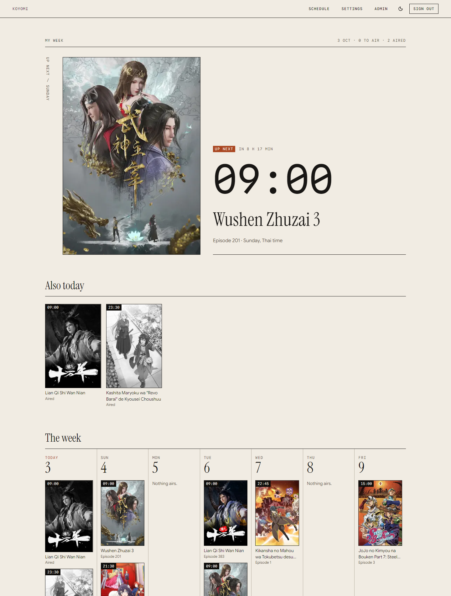
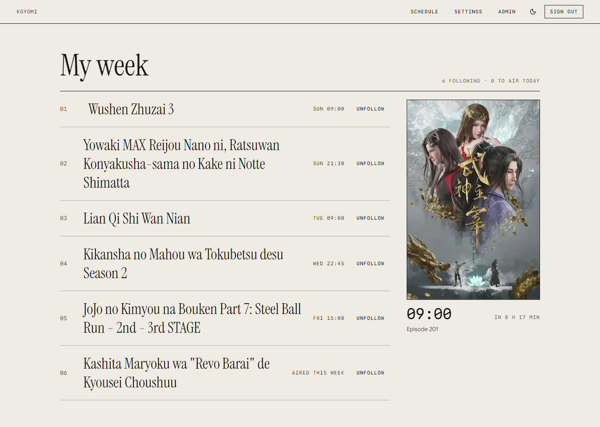
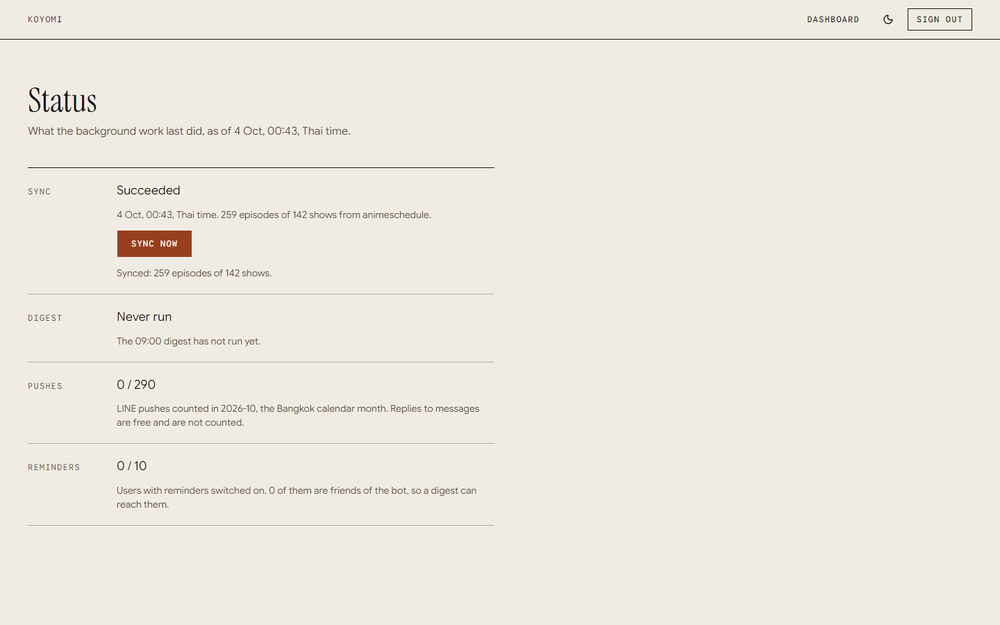
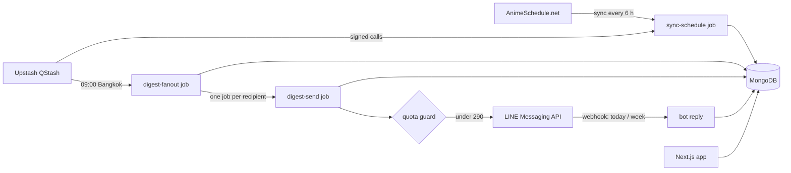

<div align="center">

# Koyomi

**Every airing anime, on Thai time, with a LINE message on the days your shows air.**

An airing tracker for the current anime season. Follow the shows you watch, see the week laid out
in Thai time, and get one LINE message each morning that lists what airs tonight.

[](https://nextjs.org/)
[](https://www.typescriptlang.org/)
[](https://tailwindcss.com/)
[](https://mongoosejs.com/)
[](https://developers.line.biz/)
[](https://playwright.dev/)



<sub>Recorded from the running app with the real schedule. Cover art belongs to its rights holders and is loaded from the AnimeSchedule.net image host.</sub>

</div>

## Screenshots

Taken from the running app with the real schedule from AnimeSchedule.net. There is also a dark theme.

<p align="center">
  
  <br><sub><b>Landing</b>: a blurred poster behind the pitch, with LINE's green only where it stays readable.</sub>
</p>

<p align="center">
  
  <br><sub><b>Schedule</b> (public): the next episode up top, seven day links, then a poster wall per day. A day runs 05:00 to 05:00 so a late-night episode stays with the evening it belongs to. Aired episodes are greyed out.</sub>
</p>

<p align="center">
  
  <br><sub><b>My week, Feature view</b>: the next episode of the shows you follow, the rest of today, then the week in seven columns.</sub>
</p>

<p align="center">
  
  <br><sub><b>My week, Index view</b>: a numbered list, soonest first, with a pinned cover that follows the pointer and keyboard focus. Chosen in settings.</sub>
</p>

<p align="center">
  
  <br><sub><b>Status</b> (administrators only): the last schedule sync, the last digest run, pushes this month and reminder places taken.</sub>
</p>

## What Koyomi does

- **Schedule in Thai time**: the season's airing schedule from AnimeSchedule.net, converted from
  Japanese broadcast times, public and server-rendered.
- **Follow shows**: one click from the schedule; a signed-out visitor is sent to sign in and back.
- **My week**: two views of what your shows air, chosen per user; finished and delayed shows are
  marked, and every one can be unfollowed.
- **Daily LINE digest**: one message at 09:00 Bangkok time on each day a followed show airs, at
  most once per user and day however often a job is retried.
- **LINE bot**: send `today` or `week` to the bot and it answers with your followed episodes.
- **LINE Login or email**: email and password with verified email, password reset and rate limits,
  plus LINE sign-in when configured.
- **Admin status page**: last schedule sync, last digest run with its delivery counts, pushes this
  month, reminder places taken.

## Engineering highlights

- **Seams with fakes, so the whole product runs offline.** The schedule source, the job queue and
  the LINE messenger are interfaces with a real implementation and a fake one chosen by
  `USE_FAKES`. The end-to-end tests run the real app against the fakes; the pictures above use the
  real schedule.
- **Idempotent daily digest.** One unique `(day, user)` row is claimed with a lease before pushing,
  and the LINE retry key is derived from the same pair, so a job that dies mid-send is repeated
  without a second message.
- **A quota guard no push can bypass.** LINE's free tier allows 300 pushes a month; a single
  conditional update takes a place under 290, so the 291st push is refused without a counter to
  race on. Replies are free and skip it.
- **Signed job endpoints.** Every `/api/jobs/*` route verifies the QStash signature over the raw
  body, including the subject URL, before it parses anything, and answers 503 while the signing
  keys are unset.
- **LINE Login hardened, each rule pinned by a test.** LINE never reports an email as verified, so
  there is no session until the emailed link is used, and a LINE sign-in never attaches itself to
  an existing account by email.
- **Time handled in one place.** A schedule day is 05:00 to 05:00 in `Asia/Bangkok`, and only
  `day-window.ts` knows it.
- **Quality gates in git, not in memory.** Git hooks block secrets, check formatting, lint (zero
  warnings, typed rules) and typecheck on commit, and run the full suite on push. Layering is
  lint-enforced: shared code never imports features.
- **Tested in a real browser.** Vitest with an in-memory MongoDB, plus Playwright journeys that
  include an axe accessibility scan of every page in both themes.
- **A design system, not defaults.** "Linen Editorial": warm paper, ink text and one terracotta
  accent, with quiet ease-out motion that switches off under `prefers-reduced-motion`.



## Stack

Next.js 16 (App Router) and TypeScript, shadcn/ui on Tailwind CSS 4, the `motion` package, MongoDB
with Mongoose, Better Auth, Upstash QStash for scheduled jobs, the LINE Login and Messaging APIs,
Zod at every boundary, Vitest and Playwright. Bun is the package manager.

## Status

Built: the schedule sync and public schedule, follows, My week, LINE Login and settings, the
scheduled jobs with the daily digest, the bot's `today` and `week` replies and the admin page.
Delivery through a real QStash account and a real LINE channel is not yet verified; no accounts
existed when it was built. The owner steps are in `.env.example`.

## Getting started

1. Copy `.env.example` to `.env.local` and fill in the values (see below).
2. Start MongoDB at the address in `MONGODB_URI`.
3. Run the dev server:

```bash
bun dev
```

Open [http://localhost:3000](http://localhost:3000).

Before calling work done, run the baseline gate (format check, lint, typecheck, tests, production build):

```bash
./verify.sh
```

Tests use an in-memory MongoDB, so they need no local database and no secrets.

## Environment variables

| Variable | Required | Purpose |
| --- | --- | --- |
| `MONGODB_URI` | yes | MongoDB connection string. |
| `BETTER_AUTH_SECRET` | yes | Signing secret, at least 32 random characters. |
| `BETTER_AUTH_URL` | yes | Public origin of the app, no trailing slash. |
| `ADMIN_EMAILS` | no | Comma-separated emails that become admins when their account is created. |
| `LINE_MESSAGING_CHANNEL_ACCESS_TOKEN` | for reminders | Messaging API channel access token the daily digest is pushed with. |
| `QSTASH_TOKEN` | for scheduled jobs | Upstash QStash token the app publishes jobs with. |
| `QSTASH_URL` | no | QStash API address when the account is not in the default region. |
| `QSTASH_CURRENT_SIGNING_KEY`, `QSTASH_NEXT_SIGNING_KEY` | for scheduled jobs | Keys QStash signs its calls with; without both, every job endpoint refuses every call. |

The schedule source and LINE Login variables, and the console steps for each service, are in
`.env.example`.

Never commit `.env.local`.

## Scheduled jobs and the daily digest

Background work runs through [Upstash QStash](https://upstash.com/docs/qstash), which calls
signature-checked endpoints under `/api/jobs/`:

- `sync-schedule`: every six hours, and at 08:45 Bangkok time.
- `digest-fanout`: at 09:00 Bangkok time. It enqueues one `digest-send` job for each user with
  reminders on who follows an episode airing that day; each of those pushes one LINE message.

A digest is sent at most once per user and day however often a job is retried, is skipped when the
last successful sync is more than 24 hours old, and stops at 290 pushes per month.

Creating the Upstash QStash account is a manual step. After deploying with the QStash variables set,
create the three schedules once (safe to repeat; it overwrites them by id):

```bash
bun scripts/create-qstash-schedules.ts --dry-run   # print what would be created
bun scripts/create-qstash-schedules.ts
```

Run it with `QSTASH_TOKEN` and the deployed `BETTER_AUTH_URL` in the environment; QStash cannot call
`localhost`.

## Authentication

- Email and password with required email verification, password reset, a protected `/dashboard`,
  and roles (`user`, `admin`).
- Emails are printed to the server console in development (`src/features/auth/email.ts`). Open the
  logged link to verify an address or reset a password. Swap that one function for a real provider
  in production.
- Auth endpoints are rate limited per client IP. The IP is read from `x-forwarded-for` as Vercel
  sends it; on other hosting configure `advanced.ipAddress` in `src/features/auth/auth.ts` first.
- An email listed in `ADMIN_EMAILS` becomes an admin when its account is first created.

## Regenerating the pictures

The screenshots and the clip above come from `scripts/media/capture.spec.ts`. It signs up in the
real app, syncs the real schedule from the admin page, follows shows and walks through the pages. It
needs a `.env.local` with `MONGODB_URI` and `ANIMESCHEDULE_TOKEN`, and uses a database of its own
(`koyomi-media`, dropped at the start of each run):

```bash
bun run media
```

It writes the stills to `docs/images/` and the raw clip to `test-results/`; the GIF is cut from that
clip by hand.
